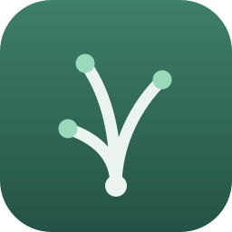

<p align="center">

</p>

<h1 align="center">Sedge</h1>

<p align="center">A local-first, block-based knowledge base. Your notes stay in your own files, on your own machine.</p>

---

## About this project

**Sedge is a fork of [SiYuan](https://github.com/siyuan-note/siyuan)**, © 2020-present
[b3log.org](https://b3log.org), which is licensed under the GNU AGPL v3. Sedge is an
independent project and is **not** affiliated with, endorsed by, or supported by the
SiYuan project or its maintainers. Please do not report Sedge issues to them.

Sedge keeps SiYuan's editor, block model and plugin ecosystem, and differs in one
deliberate way: **it has no accounts, no subscriptions and no hosted services.**

| | SiYuan | Sedge |
|---|---|---|
| Account / sign-in | Required for sync and paid features | **None — there is no account system** |
| Subscription tier | Gates some features | **None — every feature is available** |
| Sync | Official cloud, S3, WebDAV, local | **S3, WebDAV, local filesystem** |
| Plugin & theme marketplace | Yes | Yes (reads the same public index) |
| Telemetry to vendor servers | Yes | **Removed** |

Everything runs on your machine. Sync is optional and, when enabled, goes to storage
**you** configure and control.

## Licence

Sedge is free software under the **GNU Affero General Public License v3**. See
[LICENSE](LICENSE).

Because the AGPL is a network copyleft licence, two things follow and are worth
stating plainly:

1. If you run Sedge as a network service, you must offer its complete corresponding
   source to the people who use it over that network.
2. Any fork or modification of Sedge must also be released under the AGPL v3.

The complete corresponding source for this project is at
<https://github.com/BharanitharanKR/personal_Knowledge_graph>.

Third-party dependency licences are listed in
[THIRD_PARTY_NOTICES.md](THIRD_PARTY_NOTICES.md).

## Building from source

Requires Go 1.26+, Node.js 20+, and pnpm.

```sh
# kernel
cd kernel && go build ./...

# frontend
cd app && pnpm install && pnpm run build

# desktop packages (see scripts/ for per-platform kernel builds first)
cd app && pnpm run dist-darwin-arm64   # or dist, dist-linux, ...
```

macOS and Windows packages are unsigned by default. To sign, set `mac.identity` in
the relevant `app/electron-builder-*.yml` to your own Apple Developer ID.

## Data location

| | Path |
|---|---|
| Workspace (your notes) | `~/Sedge` (macOS: `~/Library/Application Support/Sedge`) |
| Global config | `~/.config/sedge` |
| URL scheme | `sedge://blocks/<id>` |

Notes imported from SiYuan keep working: Sedge still reads `siyuan://` block links,
and the on-disk `.sy` document format and `.siyuan/` notebook metadata are unchanged.

## Acknowledgements

Sedge exists because of the years of work the SiYuan maintainers and contributors put
into the original project. If you find Sedge useful, consider
[supporting SiYuan](https://github.com/siyuan-note/siyuan).
