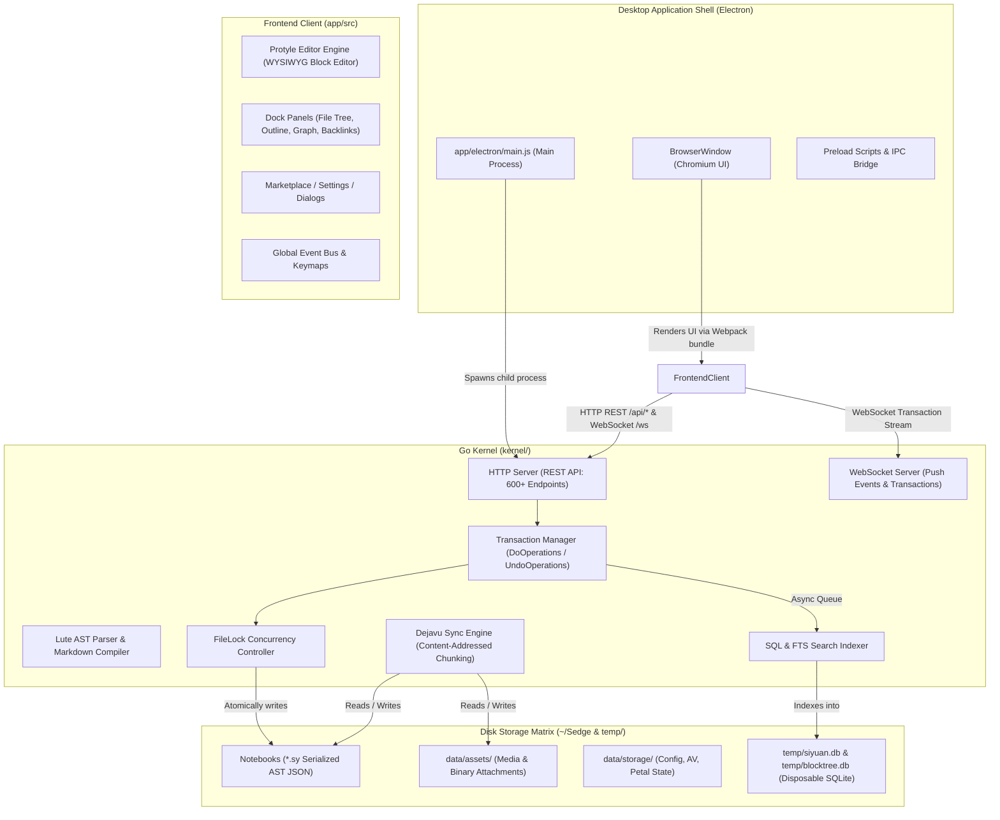
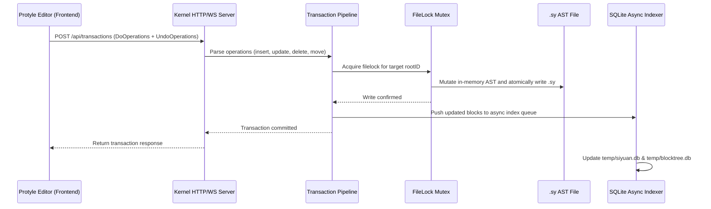
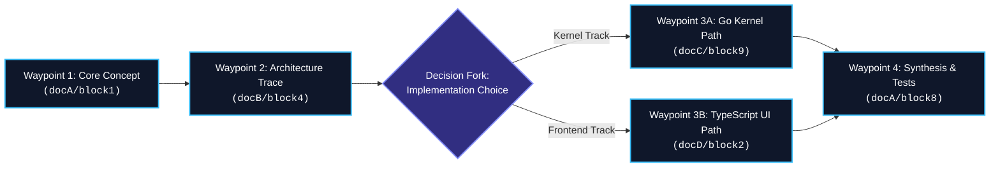

# Sedge Architecture & Development Guide

This document provides a comprehensive technical architecture and development guide for **Sedge**, as well as the complete engineering specification for the **Associative / Guided Reading Trails (`feat-trail`)** feature.

---

## Part 1: Sedge System Architecture

### 1.1 Philosophy & Foundational Decisions

Sedge is an independent fork of [SiYuan](https://github.com/siyuan-note/siyuan) (v3.8.3), licensed under the **GNU Affero General Public License v3 (AGPL-3.0)**. Sedge preserves SiYuan's block-level document model, rich-text WYSIWYG editor (Protyle), and plugin ecosystem while implementing a distinct operational philosophy:

- **Strictly Local-First & Account-Free:** Sedge strips away all vendor account systems, login prompts, cloud subscription paywalls, and proprietary cloud dependencies. There is no account registration, login token, or user authentication required to access any feature.
- **Zero Telemetry & External Calls:** All telemetry beacons, heartbeat pings, and analytics POST requests to vendor servers have been removed. The plugin and theme marketplace continues to query upstream's public catalog CDN, but without reporting user telemetry.
- **Unrestricted Local Features:** Capabilities previously locked behind upstream's `IsSubscriber()` check (such as block reminders, advanced export formats, and local automations) are permanently unlocked for all users.
- **Sovereign Synchronization:** Sync operates strictly via storage backends owned and configured by the user: S3-compatible object stores, WebDAV servers, or local directory / removable media replication.
- **AGPL-3.0 Copyleft Adherence:** Sedge remains free software under AGPL-3.0. In accordance with Section 5 and Section 13, all modifications, forked releases, and network-hosted deployments must make corresponding complete source code available under AGPL-3.0.

### 1.2 System Topology & Process Model

Sedge presents as a native desktop application, but its internal architecture is structured as a **decoupled Go HTTP/WebSocket backend** coupled with an **Electron / Chromium frontend client**.



#### Process Lifecycle & Port Negotiation
1. **Kernel Spawning:** In production packaged builds, Electron's main process (`app/electron/main.js`) locates an available TCP port, launches the `Sedge-Kernel` binary as a child process with `--port <port> --workspace <path>`, and waits for the kernel to establish its HTTP listener.
2. **Dev Environment Separation:** In development (`scripts/dev-run.sh`), the kernel must be booted prior to Electron. Electron detects `NODE_ENV=development` and connects to the existing kernel on port 6806 (or custom specified port) rather than spawning a duplicate process.
3. **API Boundary:** Electron executes no direct database queries or raw file modifications. The entire frontend interacts with the kernel strictly over HTTP (`POST /api/*`) using JSON payloads and listens for real-time state changes via WebSocket (`/ws`).

### 1.3 The Block-Centric Data Model

In Sedge, **everything is a block**. Documents, headings, paragraphs, code fences, blockquotes, lists, list items, tables, and attribute views are all discrete blocks with permanent, globally unique 64-bit-derived string IDs:

```
Format: YYYYMMDDHHMMSS-7alphanumeric
Example: 20260913233816-8s3oz31
```

#### On-Disk Format (`.sy` Files)
Unlike traditional note applications that store raw Markdown or HTML files on disk, Sedge notes are saved as **serialized abstract syntax trees (AST)** in JSON format (`.sy` files):
- **Parser Engine (Lute):** Sedge uses upstream `88250/lute` to parse Markdown into a typed AST.
- **Node Hierarchy:** Each `.sy` file contains a root `NodeDocument` block with nested children (`NodeHeading`, `NodeParagraph`, `NodeList`, `NodeBlockquote`, `NodeSuperBlock`, etc.).
- **Inline Attributes (IAL):** Blocks carry key-value attributes stored within their IAL (`{: id="..." updated="..." memo="..." custom-*="..."}`).
- **Integrity Implication:** Because blocks have permanent identities, block references (`NodeBlockRef`), block embeddings, dynamic queries, and bi-directional backlinks remain unbroken even when documents are renamed, reorganized, or moved across notebooks.

### 1.4 Write Path & Transaction Model

When a user edits text or alters layout in the Protyle editor, Sedge does not stream file diffs or overwrite whole files synchronously. Instead, it executes an **operation transaction pipeline**:



- **Symmetric Operation Pairs:** Every transaction generated by Protyle packages paired arrays: `DoOperations` (actions to apply) and `UndoOperations` (exact inverse actions). This architecture provides instantaneous, lossless undo/redo capabilities without differential file parsing.
- **Concurrency Safety:** Kernel-level `filelock` ensures that concurrent writes from background indexing, sync transfers, or multi-window sessions never corrupt AST JSON files.
- **Asynchronous Indexing:** Once the `.sy` tree is persisted to disk, the transaction returns success immediately. Full-text search tokenization, SQL relational metadata indexing, and graph edge calculations run in asynchronous background worker queues.

### 1.5 Ephemeral SQLite Index Architecture

A foundational architectural invariant in Sedge is that **all SQLite databases are disposable caches**:

```go
DBPath          = filepath.Join(TempDir, "siyuan.db")
BlockTreeDBPath = filepath.Join(TempDir, "blocktree.db")
```

- **Zero Data Loss on Deletion:** The user's notebook data (`~/Sedge/data/<notebook>/*.sy`) and media assets (`~/Sedge/data/assets/*`) are the single source of truth. The SQLite databases in `temp/` contain zero unreproducible user data.
- **Boot Recovery & Auto-Reindexing:** If `temp/siyuan.db` is deleted or corrupted, Sedge detects an empty index count upon startup, walks all mounted notebook directories, parses every `.sy` file, and rebuilds the relational block tree and full-text search indexes completely from scratch.

### 1.6 Synchronization Engine (`dejavu`)

Sedge's sync engine (`dejavu`) utilizes a Git-analogous content-addressed snapshot architecture:

| `dejavu` Component | Git Analogue | Technical Implementation |
|---|---|---|
| `Chunk` | Blob | Content-addressed cryptographic SHA hash chunk; deduplicated and encrypted with AES-256-GCM prior to network transmission. |
| `File` | Tree Entry | Path metadata paired with chunk hash lists representing a document or asset file. |
| `Index` | Commit | An immutable snapshot of the entire workspace state at a point in time. |
| `refs/latest` | Branch Ref / HEAD | Pointer to the latest synchronized workspace generation. |

Because `dejavu` operates on content-addressed chunks with local encryption, remote backends (S3, WebDAV, or local drives) store only zero-knowledge ciphertext blobs.

### 1.7 Load-Bearing Invariants & Developer Guardrails

When working on the Sedge codebase, developers must adhere to strict rename and editing guardrails:

> [!CAUTION]
> **Do Not Rename Load-Bearing Identifiers:**
> 1. `window.siyuan` in the frontend codebase (referenced over 9,000 times): This global object represents the public runtime ABI for plugins, themes, and extensions. Renaming it will break the entire ecosystem.
> 2. On-disk markers: `.siyuan/` directory names and `*.sy` file extensions must remain unchanged so existing user databases and third-party tools continue functioning seamlessly.
> 3. Upstream library modules: The eight `github.com/siyuan-note/*` Go dependencies (`dejavu`, `filelock`, `riff`, etc.) are external library dependencies, not self-references.
> 4. Do not hand-edit `app/stage/protyle/js/lute/lute.min.js`, `app/stage/build/**`, or `app/changelogs/**`.

### 1.8 Development Environment & Toolchain

#### Prerequisites
- **Go:** 1.26+ with CGO enabled (required for SQLite / SQLCipher compilation)
- **Node.js:** 20.x or 22.x (Node 22 is recommended for pnpm 11.25 compatibility)
- **Package Manager:** `pnpm` (version 11.25+)

#### Standard Development Commands
```bash
# Launch development environment (builds kernel, starts backend, opens Electron)
scripts/dev-run.sh

# Force kernel rebuild and run on custom port
scripts/dev-run.sh --rebuild --port 6810 --workspace ~/Sedge

# Stop any running development background instances
scripts/dev-run.sh --stop

# Verify frontend code style (MUST NOT run pnpm build while dev is active)
cd app && pnpm run lint

# Format Go code
cd kernel && gofmt -w .
```

---

## Part 2: `feat-trail` — Associative / Guided Reading Trails Specification

### 2.1 Conceptual Background & Motivation

Knowledge bases built on associative networks often suffer from the **"lost in hyperspace"** problem: as the graph expands to thousands of interconnected blocks, discovering coherent narratives, curriculum sequences, and structured thought progressions becomes difficult.

Inspired by Vannevar Bush's seminal concept of the **"Memex Associative Trail"** (*As We May Think*, 1945), the `feat-trail` feature introduces **Guided Reading Trails** into Sedge. A Trail is a curated, ordered trajectory connecting arbitrary blocks and documents across notebooks into a guided journey, complete with contextual step annotations, branch decision points, and visual graph overlays.



### 2.2 Functional Requirements

1. **Arbitrary Block Waypoints:** Any block (paragraph, code block, heading, table, or full document) can be bookmarked as a waypoint on a trail using its permanent Block ID.
2. **Linear & Branching Sequences:** Trails support sequential ordering (`Next Step`, `Previous Step`) as well as optional **forks** (branch points allowing a reader to explore deep-dive sub-paths before rejoining the main trunk).
3. **Contextual Step Annotations:** Authors can attach guiding annotations or reading prompts to a trail waypoint without altering the text or IAL of the original target block.
4. **Interactive Reading HUD:** A lightweight, non-intrusive floating navigation controller appears during trail walks, displaying waypoint progress (e.g. `Step 4 of 12`), step annotation, and keyboard hotkeys (`Alt + [` for previous, `Alt + ]` for next).
5. **Graph View Highlighting:** When viewing the Sedge Local or Global Graph, an active trail renders as an illuminated colored spline flowing sequentially through the graph nodes.
6. **Persistence & Sync Compatibility:** Trails are persisted in standard JSON format within workspace storage (`data/storage/trails/`), ensuring full compatibility with existing `dejavu` sync providers.

### 2.3 Data Model & Storage Schema

#### JSON Schema (`data/storage/trails/<trailId>.json`)

```typescript
export interface ITrail {
    id: string;              // Unique Trail ID (e.g., "20260913234500-tr01abc")
    title: string;           // Display title of the trail
    description: string;     // Overview and learning objective of the trail
    author: string;          // Creator identifier
    icon?: string;           // Emoji or icon identifier
    color?: string;          // Hex color for graph visualization (e.g. "#38bdf8")
    tags: string[];          // Categorization tags
    created: number;         // Millisecond epoch timestamp
    updated: number;         // Millisecond epoch timestamp
    steps: ITrailStep[];     // Ordered sequence of waypoints
}

export interface ITrailStep {
    stepId: string;          // Unique step ID within the trail
    blockId: string;         // Target block ID (e.g., "20260911141346-k0yfip9")
    rootId: string;          // Target document root ID containing the block
    title?: string;          // Custom step label (defaults to block heading/text)
    annotation?: string;     // Curator's guiding prose / commentary for this step
    forks?: ITrailFork[];    // Optional branch options diverging from this waypoint
}

export interface ITrailFork {
    forkId: string;          // Unique branch ID
    label: string;           // Human-readable fork decision prompt
    targetTrailId?: string;  // Sub-trail to branch into, or inline step sequence
    divergeSteps: ITrailStep[]; // Steps unique to this branch before rejoin
}
```

#### SQLite Indexing Schema (`temp/siyuan.db`)
For rapid querying, search filtering, and referential integrity verification, the kernel maintains an index table in SQLite:

```sql
CREATE TABLE IF NOT EXISTS trails (
    id TEXT PRIMARY KEY,
    title TEXT,
    description TEXT,
    icon TEXT,
    color TEXT,
    step_count INTEGER,
    created INTEGER,
    updated INTEGER
);

CREATE TABLE IF NOT EXISTS trail_steps (
    step_id TEXT PRIMARY KEY,
    trail_id TEXT,
    sort INTEGER,
    block_id TEXT,
    root_id TEXT,
    title TEXT,
    annotation TEXT,
    FOREIGN KEY(trail_id) REFERENCES trails(id) ON DELETE CASCADE
);

CREATE INDEX IF NOT EXISTS idx_trail_steps_block ON trail_steps(block_id);
CREATE INDEX IF NOT EXISTS idx_trail_steps_root ON trail_steps(root_id);
```

### 2.4 Kernel API Endpoints (`kernel/api/trail.go`)

The Go kernel exposes a dedicated REST API under `/api/trail/*`:

| Endpoint | Method | Payload | Description |
|---|---|---|---|
| `/api/trail/createTrail` | `POST` | `{"title": string, "description": string, "tags": string[]}` | Creates a new trail definition and registers it in storage and SQLite. |
| `/api/trail/getTrail` | `POST` | `{"id": string}` | Retrieves a complete trail schema including all nested steps and forks. |
| `/api/trail/listTrails` | `POST` | `{"keyword": string, "page": int, "pageSize": int}` | Lists available trails with step counts and metadata. |
| `/api/trail/updateTrail` | `POST` | `ITrail` | Atomically updates trail metadata and re-indexes steps. |
| `/api/trail/deleteTrail` | `POST` | `{"id": string}` | Removes the trail file and purges associated SQLite records. |
| `/api/trail/addStep` | `POST` | `{"trailId": string, "blockId": string, "annotation": string, "index": int}` | Inserts a block waypoint into a trail at the designated position. |
| `/api/trail/removeStep` | `POST` | `{"trailId": string, "stepId": string}` | Removes a waypoint and adjusts sequential sort indices. |
| `/api/trail/reorderSteps` | `POST` | `{"trailId": string, "stepIds": string[]}` | Updates the step sequence following drag-and-drop actions. |

#### Block Lifecycle Handling
When a block is deleted or relocated during standard editing transactions:
- **Relocation:** If a block moves to a different document, the kernel's transaction observer updates `root_id` in `trail_steps` automatically.
- **Deletion:** If a block is permanently deleted, the step remains in the trail schema but is flagged with `is_orphaned: true`, presenting a visual indicator in the UI allowing the user to repair or discard the step.

### 2.5 Frontend UI / UX Architecture

```mermaid
graph TD
    subgraph UI Components ["Trail Frontend Architecture (app/src/trail)"]
        DockTab["Trail Dock Tab (app/src/layout/dock/trail.ts)"]
        ProtyleMenu["Protyle Context Menu ('Add to Trail')"]
        ReadingHUD["Floating Reading HUD (app/src/trail/hud.ts)"]
        GraphRenderer["Graph Spline Overlay (app/src/layout/dock/graph.ts)"]
    end

    subgraph State Store ["Trail State Store"]
        ActiveTrail["Active Trail Object"]
        CurrentStepIndex["Current Step Index (Pointer)"]
        IsReadingMode["Reading Mode Active (Boolean)"]
    end

    DockTab -->|Selects Trail| ActiveTrail
    DockTab -->|Reorders Steps| ActiveTrail
    ProtyleMenu -->|Dispatches blockId| DockTab
    ActiveTrail --> ReadingHUD
    CurrentStepIndex --> ReadingHUD
    ReadingHUD -->|Alt + ] / Alt + [| CurrentStepIndex
    CurrentStepIndex -->|Scrolls to Block & Highlights| ProtyleEditor["Protyle Editor"]
    ActiveTrail -->|Renders Path| GraphRenderer
```

#### 1. Dock Tab (`app/src/layout/dock/trail.ts`)
- Added to the dock panel alongside File Tree, Outline, Bookmarks, and Graph.
- Lists all created trails with search filtering and tag categorization.
- Expanding a trail displays the ordered list of waypoints. Clicking any waypoint immediately opens the containing document and scrolls the target block into focus.
- Supports drag-and-drop step reordering using standard HTML5 drag-and-drop APIs.

#### 2. Protyle Editor Integration (`app/src/menus/protyle.ts`)
- Right-clicking any block gutter icon or highlighted selection displays the **"Add to Trail..."** context menu option.
- Opens a quick-select popover to append the block to an existing trail or initiate a new one.

#### 3. Floating Guided Reading HUD (`app/src/trail/hud.ts`)
- When a user activates **"Walk Trail"**, a floating pill HUD appears at the bottom-center of the active editor view.
- Displays:
  - Trail name and current step counter (`Step 3 of 10`)
  - Waypoint title and author annotation callout
  - Navigation buttons: `[< Previous]` and `[Next >]`
  - Keyboard shortcuts: `Alt + [` and `Alt + ]`
  - Fork selector menu if the current waypoint contains decision branches
  - Exit button to conclude the guided walk

#### 4. Graph View Visualization (`app/src/layout/dock/graph.ts`)
- In both Global Graph and Local Graph views, an active trail renders an illuminated bezier spline or directional particle pulse linking node waypoints in sequence.
- Unvisited waypoints appear in dimmed accent color, the active waypoint glows with high contrast, and visited waypoints show a completed check state.

### 2.6 Implementation Roadmap

| Milestone | Deliverables | Verification Strategy |
|---|---|---|
| **Phase 1: Kernel Foundation** | 1. Implement `kernel/model/trail.go` and schema definitions.<br>2. Register REST API endpoints in `kernel/api/trail.go`.<br>3. Add `trails` and `trail_steps` tables to SQLite initialization.<br>4. Hook transaction listener for block move/delete events. | Execute Go unit tests (`go test ./kernel/model/...`) verifying CRUD, transaction ordering, and SQLite index synchronization. |
| **Phase 2: Frontend Dock & Menu** | 1. Register `trail` icon in `app/appearance/icons/litheness/icon.js`.<br>2. Build Trail dock tab (`app/src/layout/dock/trail.ts`).<br>3. Implement "Add to Trail" in Protyle context menus.<br>4. Add i18n localization keys to all language JSON files. | Run `pnpm run lint` and verify dock tab rendering and drag-and-drop reordering in dev mode. |
| **Phase 3: Guided Reading HUD** | 1. Build floating HUD component (`app/src/trail/hud.ts`).<br>2. Implement step navigation hotkeys (`Alt + [` / `Alt + ]`).<br>3. Add smooth scrolling and block highlight pulse in Protyle. | Test guided tour navigation across multiple notebooks and verify fork decision routing. |
| **Phase 4: Graph View & Polish** | 1. Add trail spline overlay in graph view renderer.<br>2. Add export trail to Markdown / HTML feature.<br>3. Documentation and user guide integration. | Validate visual graph rendering and export fidelity on desktop packages. |
